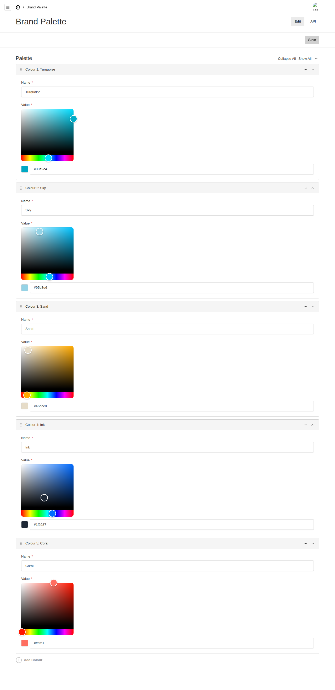
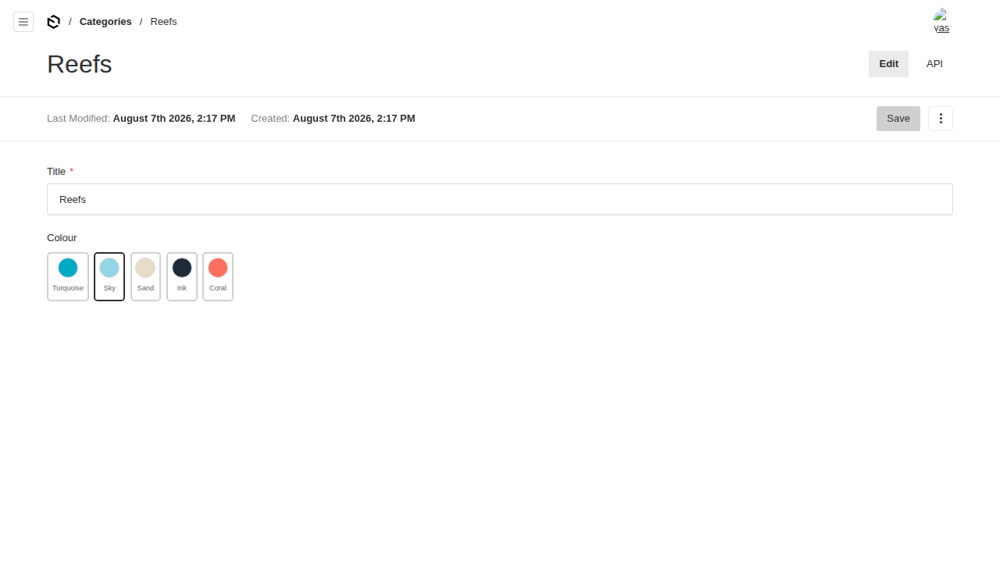

# @foundrykit/brand-palette-plugin

Editor-managed **brand colour palette** for [Payload CMS 3](https://payloadcms.com). Define your palette once in the admin, then pick from it anywhere with a swatch field — so colours across the site stay on-brand and editors never hand-type hex. Ships with a hex colour picker and a light/dark theme provider for the frontend.

Extracted from the Turquoise Settings/branding code and generalised: the palette lives in its own configurable global, and the swatch field reads from whichever global/path you point it at.

## Features

- **Palette global** — a list of named colours (`name` + `value`) edited with a proper hex picker (react-colorful). Ships as its own `brand-palette` global by default.
- **Swatch colour field** — `colourField()` renders the palette as clickable swatches; editors pick a brand colour and the field stores its hex. Configurable source global + path.
- **Hex picker field** — `HexColourInput`, the saturation/hue picker + hex input, reusable on any text field.
- **Theme provider** — `ThemeProvider` / `useTheme` for the frontend: sets `data-theme` on `<html>`, respects OS preference, persists the choice.
- **Fully configurable** — global slug, admin group, palette field name, and the swatch field's source are all options; nothing is hardcoded to one project.

## Screenshots

**Brand Palette global** — named colours edited with the hex picker



**Swatch field on a document** — pick a brand colour (here "Sky" is selected)



---

## Installation

```sh
pnpm add @foundrykit/brand-palette-plugin
```

Peer deps: `payload`, `@payloadcms/ui`, `react`. `react-colorful` ships as a dependency. Run `payload generate:importmap` after adding it (automatic on dev/build).

## Usage

```ts
// payload.config.ts
import { brandPalettePlugin, colourField } from '@foundrykit/brand-palette-plugin'
import { buildConfig } from 'payload'

export default buildConfig({
  plugins: [brandPalettePlugin()],          // adds the `brand-palette` global
  collections: [
    {
      slug: 'categories',
      fields: [
        { name: 'title', type: 'text' },
        colourField({ name: 'colour' }),     // a swatch picker fed by the palette
      ],
    },
  ],
})
```

Editors add colours under **Brand Palette** in the admin, and every `colourField` shows them as swatches.

### Frontend theme provider

```tsx
import { ThemeProvider, useTheme } from '@foundrykit/brand-palette-plugin/client'

// wrap your app
<ThemeProvider>{children}</ThemeProvider>

// toggle anywhere
const { theme, setTheme } = useTheme()
<button onClick={() => setTheme(theme === 'dark' ? 'light' : 'dark')}>Toggle</button>
```

## Configuration

```ts
brandPalettePlugin({
  globalSlug?: string        // default 'brand-palette'
  adminGroup?: string        // default 'Settings'
  paletteFieldName?: string  // default 'palette'
  addGlobal?: boolean        // register the global, default true
  disabled?: boolean
})

colourField({
  name?: string              // default 'colour'
  globalSlug?: string        // where to read swatches, default 'brand-palette'
  palettePath?: string       // dot-path to the palette array, default 'palette'
  required?: boolean
  overrides?: Partial<Field>
})
```

Want the palette inside an existing global instead of a standalone one? Set `brandPalettePlugin({ addGlobal: false })`, add the palette array to your own global, and point the field at it: `colourField({ globalSlug: 'settings', palettePath: 'branding.palette' })`.

## Exports

- `@foundrykit/brand-palette-plugin` — `brandPalettePlugin`, `colourField`, `paletteGlobal`, types.
- `@foundrykit/brand-palette-plugin/client` — `ColourSwatchField`, `HexColourInput`, `PaletteRowLabel`, `ThemeProvider`, `useTheme` (field components register via the import map).

## Development

```sh
pnpm install
pnpm dev          # dev admin at http://localhost:3000/admin — seeded palette + a category using the swatch field
pnpm test         # unit + integration + e2e
pnpm test:unit    # field/global/plugin factories
pnpm test:int     # global registration + palette storage + colour value on a doc
pnpm build && pnpm verify:pack
```

> Note: the E2E harness talks to the dev server over `localhost` (not `127.0.0.1`) — in the sandbox the headless browser proxies `127.0.0.1` and can't load the client bundle, so the admin components wouldn't hydrate.

## License

MIT © Isaac SJ / Umi
